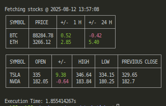

# Stock Ticker

This is a simple stock ticker application that fetches and displays stock/crypto prices in real-time.



## Setup

* Environment variables will need to be set for the application to run. Add these to your preferred method for setting environment variables, such as your shell configuration.

    ```bash
    export FINNHUB_API_KEY='FINNHUB_API_KEY'
    export CMC_API_KEY='CMC_API_KEY'
    ```
* `FINNHUB_API_KEY` can be obtained from [Finnhub](https://finnhub.io/). This is used for stock prices.
* `CMC_API_KEY` can be obtained from [CoinMarketCap](https://coinmarketcap.com/api/) for crypto prices.

## Configuration

* The application can be configured to display specific stocks or cryptocurrencies by modifying the `config/symbols.yaml` file.
* Cryptocurrency symbols are used to fetch prices from CoinMarketCap.
* Stock ISIN codes are used to fetch the stock symbols from Finnhub, which are then used to fetch the stock prices. ISIN codes are used to ensure that the correct stock is fetched, as stock symbols can vary by exchange.

## TODO

* Wrap API calls with `goroutine` for better performance.
* Unit tests for the API calls.